# SAP Commerce Operator

This operator manages the process for building and deploying the SAP Commerce applications to the Red Hat OpenShift Container Platform. The deployment that the operator creates is based on the architecture and approach described in the [blog](https://www.openshift.com/blog/building-and-running-sap-commerce-in-openshift).

## Requirements

- [oc](https://docs.openshift.com/container-platform/4.5/cli_reference/openshift_cli/getting-started-cli.html#installing-the-cli) 4.5

## Deploy Operator to OpenShift 4.5+ using Operator Lifecycle Manager (OLM)

1. Create a new project, e.g. `sap-commerce`

    ```bash
    oc new-project sap-commerce
    ```

2. Load the Operator with OLM

    Use the `catalog.yaml` to create a `CatalogSource` referencing the SAP Commerce operator, so that it can be subscribed with Operator Lifecycle Manager.

    Note: replace the `namespace` with your project in the yaml.

    ```bash
    oc apply -f olm/catalog.yaml
    ```

    Then wait for a couple of minutes for the `CatalogSource` to be loaded.

3. Install the Operator

    1. Navigate to `OperatorHub` in the Openshift web console.
    
    2. Search with `SAP` and select the `SAP Commerce Operator`.
       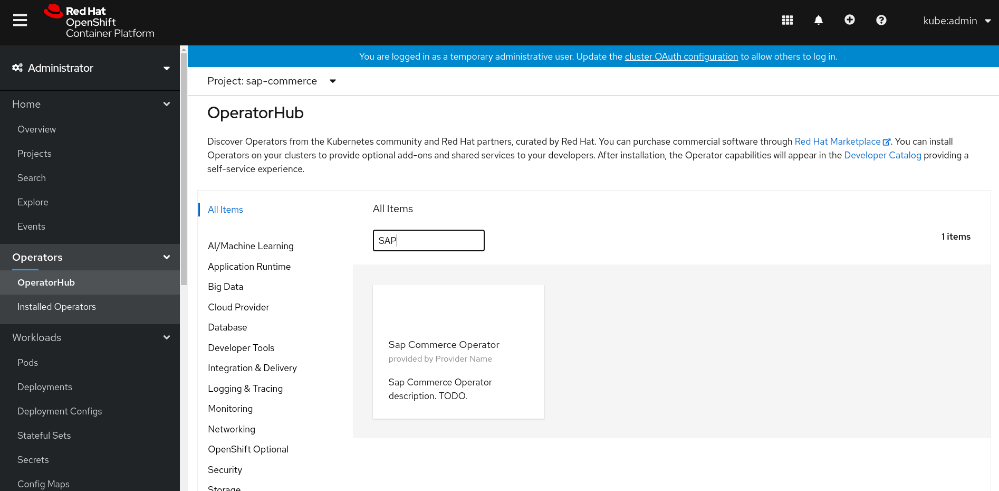
    
    3. Install the operator in your project, e.g. `sap-commerce`.
       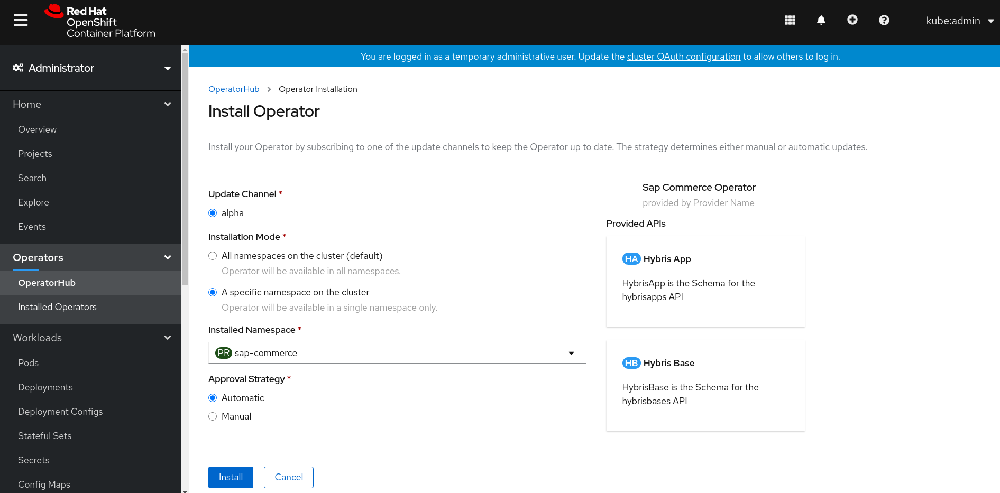
    
    4. Wait for the operator to finish installation.
       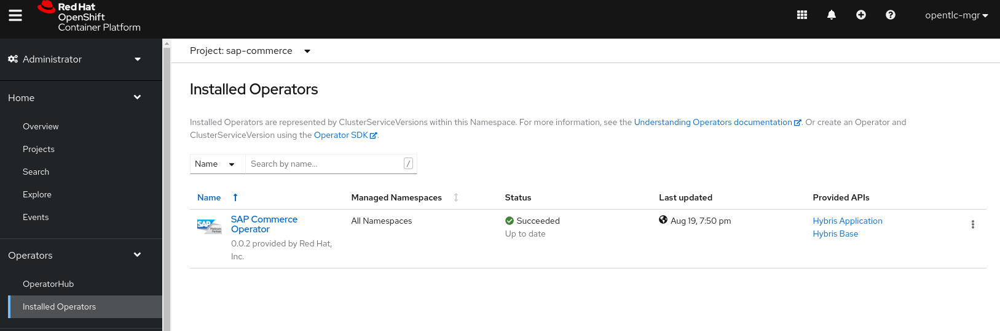

## Build Base Image

1. Create Hybris package and upload to nexus

    1. Download [SAP Commerce](https://help.sap.com/viewer/product/SAP_COMMERCE/1905/en-US) zip file from SAP.
    
    2. Use the `package-hybris.sh` scripts to create the hybris package `hybris.tar.gz` that can be used to build the base image.
    
    ```bash
    ./hack/package-hybris.sh <path to the SAP Commerce zip file>
    ```
   
   3. Upload the `hybris.tar.gz` package to a nexus server that is accessible from your Openshift cluster.
      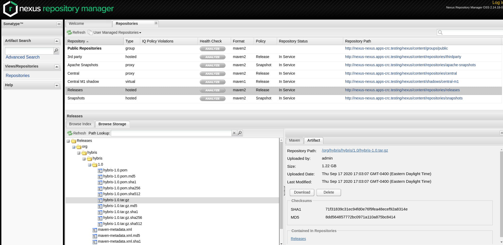

2. Create Hybris base image with operator
    
    1. Navigate to `Installed Operators` in the Openshift web console
    
    2. Select `Hybris Base` from the `Provided APIs` of the `SAP Commerce Operator`
    
    3. Create a `HybrisBase` by entering the following specs:
        
        1. imageName: the `image stream` name of the Hybris base image
        
        2. imageTag: the `image stream` tag of the Hybris base image
        
        3. URL: the URL to download the `hybris.tar.gz` package from the nexus server 
          
        4. username: username that is used to access the nexus server
         
        5. passowrd: password that is used to access the nexus server
         
        6. jdkURL: the URL to download the SAP JDK 
       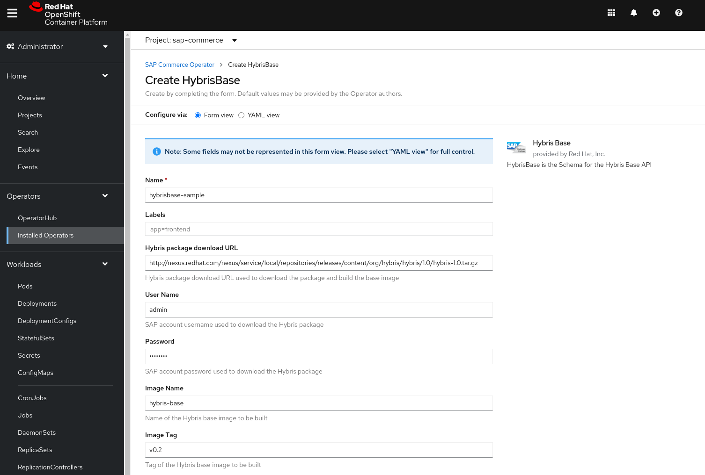
    
    4. A `Build` will be created to build the Hybris base image
    
       Wait for the `Build` to complete successfully before deploying the SAP Commerce application.
       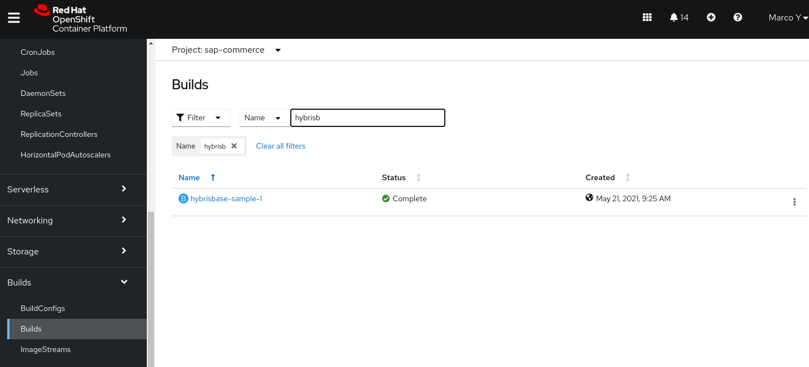

## Deploy SAP Commerce Application

1. Create Hybris application with operator

    1. Navigate to `Installed Operators` in the Openshift web console.
        
    2. Select `Hybris App` from the `Provided APIs` of the `SAP Commerce Operator`
    
    3. Create a `HybrisApp` by entering the following specs:
        
        1. baseImageName: the `image stream` name of the Hybris base image
        
        2. baseImageTag: the `image stream` tag of the Hybris base image
        
        3. sourceRepoURL: the URL of your Hybris application source code repository
          
        4. sourceRepoRef: a tag or branch of your Hybris application source code
         
        5. sourceRepoContext: an optional subdirectory of your source code for your Hybris application
       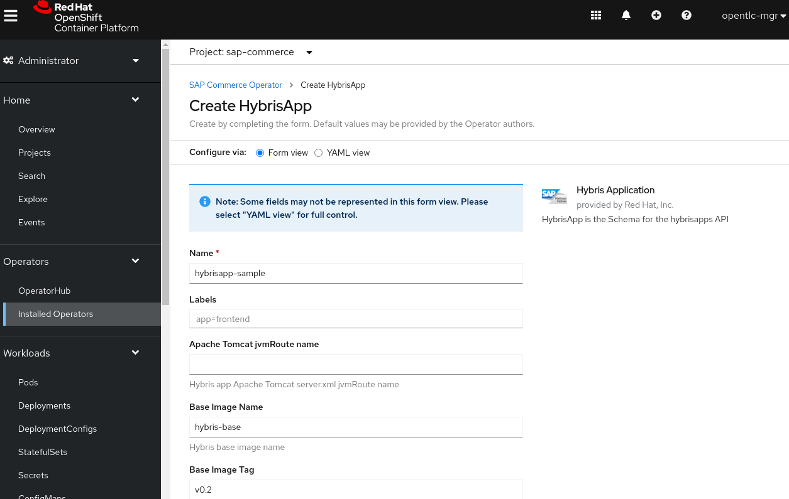
        6. Apachejvm Route Name: an optional property that replaces the Apache Tomcat server.xml for the jvmRoute with a value of 'ChangeMe' to one specified here
        7. Source Repo Local Properties Override: an optional property that provides a absolute path of file for a Git path that can replace the contents of local.properties used by Hybris
        8. Hybris ANT Task Names: a custom list of Hybris ANT tasks to execute. This entry default to ANT tasks 'clean,all'. The user can override the default here
       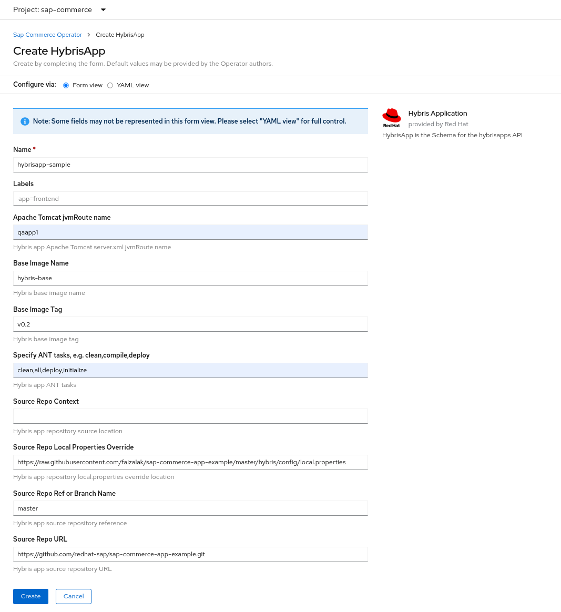
    
    4. A `Build` will be created to build the Hybris app image
       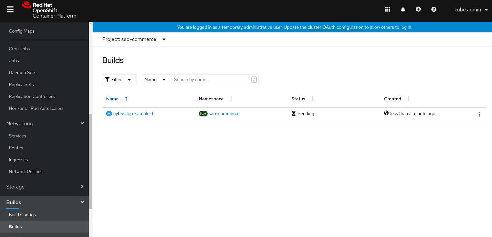
    
    5. Once the `Build` completes successfully, a `DeploymentConfig`, `Service` and `Route` will be created for deploying the Hybris application.
       
    6. Use the Hybris application `Route` location to access the console
       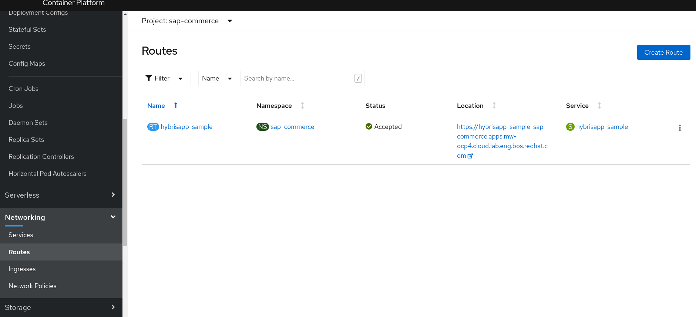
        

2. Load Hybris licence

    1. Download your `hybrislicence.jar`
    
    2. Encode the licence file with `base64`
    
       ```bash
       base64 -w 0 <path to your licence jar file>
       ```
    
    3. Update the data `hybrislicence.jar` of the `Secret` for Hybris licence with the encoded licence
       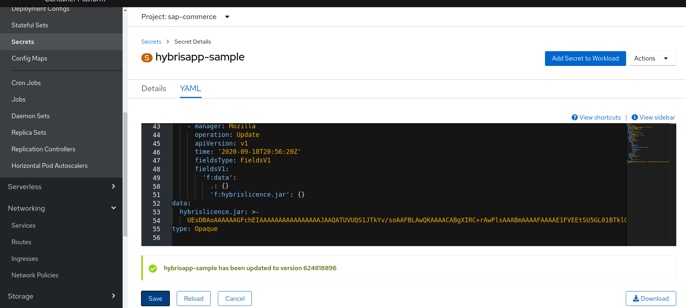

3. Change runtime configuration

   Use the `ConfigMap` for Hybris properties to change the runtime configuration. 
   
   Change the properties in the data `local.properties` of the `ConfigMap`.
   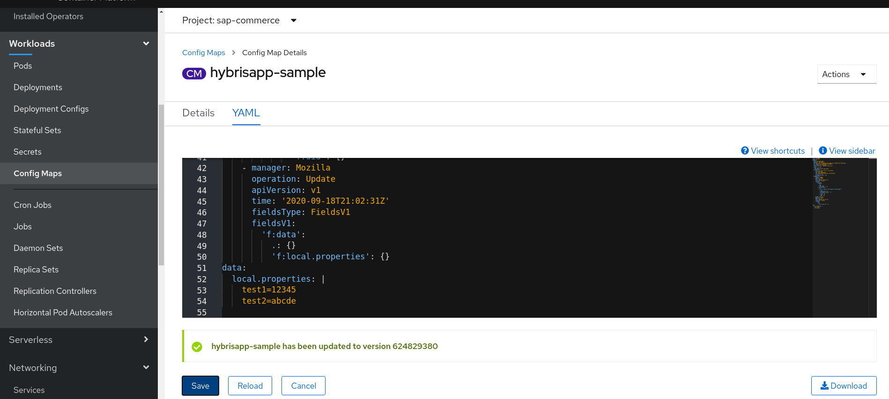
   
## Development

### Requirement
- [Go](https://golang.org/) 1.13+
- [Docker](https://www.docker.com/) 17.03+
- [Operator SDK](https://sdk.operatorframework.io/docs/installation/install-operator-sdk/#install-from-github-release) v1.0.0
- [Kubebuilder](https://book.kubebuilder.io/quick-start.html#installation) v2.3.1
- [opm](https://github.com/operator-framework/operator-registry/blob/master/docs/design/opm-tooling.md) v1.13.8

### Build Operator
    
   1. To build the operator image
   
      ```bash
      make docker-build IMG=<your operator image name>:<your operator image tag>
      ```

   2. To push your operator image to registry
   
      ```bash
      make docker-push IMG=<your operator image name>:<your operator image tag>
      ```

### Deploy Operator Manually

   1. Build the operator CRD manifests
      
      ```bash
      make manifests
      ```
    
   2. Use `oc` to deploy the following resources to your project to deploy the operator
     
      - `config/rbac/role.yaml`
      - `config/rbac/role_binding.yaml`
      - `config/crd/base/hybris.hybris.org_hybrisapps.yaml`
      - `config/crd/base/hybris.hybris.org_hybrisbases.yaml`
      - `config/manager/manager.yaml`
     
      Note: please update values of the `namespace` and `image` fields in the yamls to reflect your project and operator image.
     
   3. Use `oc` to deploy the following resources to deploy your SAP Commerce application
     
      - `config/samples/hybris_v1alpha1_hybrisbase.yaml`
      - `config/samples/hybris_v1alpha1_hybrisapp.yaml`
     
      Note: please update the specs of the sample yamls to reflect your desired deployment.

### Deploy Operator with OLM

   1. Build the bundle
       
      ```bash
      make bundle
      ```
      
   2. Build and push the bundle image
   
      ```bash
      docker build -t <your bundle image name>:<your bundle image tag> -f bundle.Dockerfile .
      docker push <your bundle image name>:<your bundle image tag>
      ```
     
   3. Build and push the index image
      
      ```bash
      opm index add --bundles <your bundle image name>:<your bundle image tag> --tag <your index image name>:<your index image tag> --container-tool docker
      docker push <your index image name>:<your index image tag>
      ```
   4. Deploy the operator
   
      Update the `image` field of `olm/catalog.yaml` with the index image your built. 
      
      Follow [Deploy Operator to OpenShift 4.5+ using Operator Lifecycle Manager](#deploy-operator-to-openshift-45-using-operator-lifecycle-manager-olm) to deploy the operator.
      
### References

- [Golang Based Operator Tutorial](https://sdk.operatorframework.io/docs/building-operators/golang/tutorial)
- [OLM Integration Bundle Quickstart](https://sdk.operatorframework.io/docs/olm-integration/quickstart-bundle)
- [Building an index of Operators](https://github.com/operator-framework/operator-registry#building-an-index-of-operators-using-opm)
